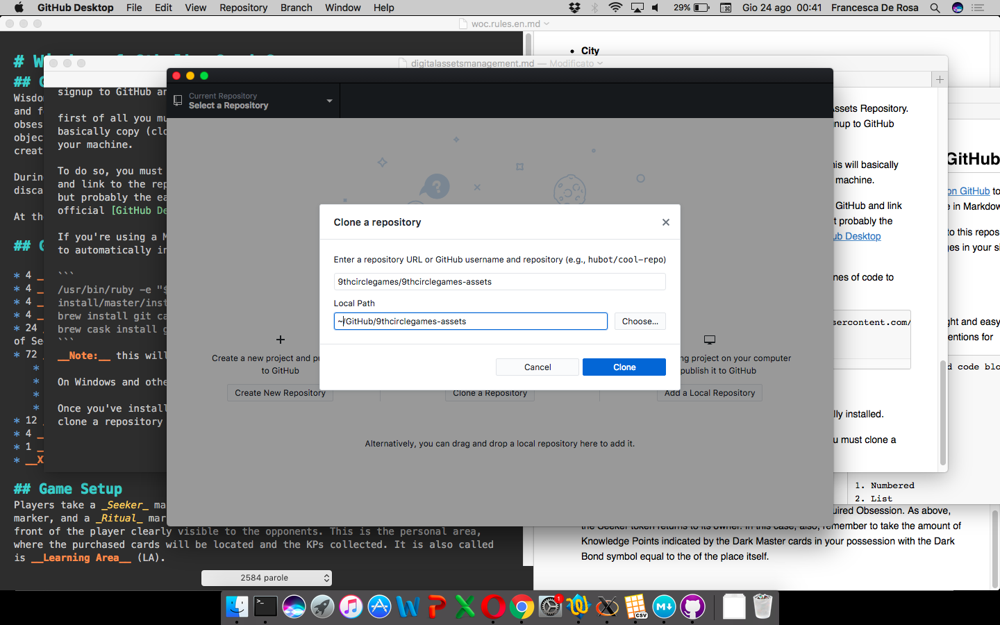

## Digital Assets Management

9th Circle Games provides a simple way to automatically manage digital assets. Digital Assets are all those __static__ files which are intended to be used on digital platforms, like web, social networks and so on. These file formats are actually supported:

* Illustrations and pictures of unlimited size (PNG and JPG formats supported of unlimited size, Retina files supported)
* Vector Illustrations (SVG)
* Videos (various formats)

### When to use it

You must use this tool for digital assets to be consumed on the web, for example illustrations for the website, posts on social networks, key visuals embedded on the newsletters, logos and so on.

You must __not__ use this tool for print-quality assets, for example illustrations at resolution suitable for printing (120dpi or more) as they could easily be leaked and stolen!

### How it works

Digital Assets are public by definition, as they are embedded in websites, social networks, newsletter and so on. This is also true for all our _digital_ properties.

Our assets are hosted on a [GitHub repository](https://github.com/9thcirclegames/9thcirclegames-assets) which looks more or less like this:


- [https://github.com/9thcirclegames/9thcirclegames-assets](https://github.com/9thcirclegames/9thcirclegames-assets)

When a new asset is _pushed_ into the repository, an automatic procedure is fired which takes care of:

* Check if all the filenames are compliant to some quality checks
* Create a standard set of versions for each picture with different dimensions
* Upload all the resulting files in our web server for static files, from where they could be called.

All these steps will be detailed in the following sections.

### Before Starting

To interact with digital assets you must have _write_ access to the Assets Repository. Only 9th Circle Games GitHub team has actually, so you must signup to GitHub and ask for being added to the team before proceeding.

first of all you must clone the repository on your local machine. This will basically copy (clone) the content of the repository on a local folder of your machine.

To do so, you must install a tool that allows you to authenticate to GitHub and link to the repositories of your choices. Several tools are available for that, but probably the easiest way to do so (if you're not a developer) is the official [GitHub Desktop Client](https://desktop.github.com).

If you're using a Mac, open a Terminal window and paste these lines of code to automatically install all the needed tools for you.

```
/usr/bin/ruby -e "$(curl -fsSL https://raw.githubusercontent.com/Homebrew/install/master/install)"
brew install git cask
brew cask install github-desktop
```
__Note:__ this will also install the official _git_ tool, just in case.

On Windows and other systems, GitHub Desktop must be manually installed.

Once you've installed the tools and authenticated with GitHub, you must clone a repository (File > Clone Repository). Once asked, put __9thcirclegames/9thcirclegames-assets__ as repo slug and choose a location for the cloned repo (the default should be ok in most cases).



Now, you are ready to manage digital assets.

### Adding or Updating a Digital Asset

The first thing to do when you want to add or replace an asset is to __sync__ with the remote server. This will ensure that your local copy is always be kept up-to-date with the remote server (don't forget that the tool is intended to be used in team!). This can easily be done by clicking on the _Sync_ button on top-right corner on GitHub Desktop.

Once your local repo is updated with the most recent version on the server, you are safe to add your stuff.

To add a new digital asset or to replace an existing one to a new version, simply save the file on the local folder of the repository, when you just cloned it. Just overwrite the existing file, in case you want to update it.

If the asset is a illustration, you must save it at the __maximum__ resolution you think it will be used (for example, if the illustration will be used in a landing page on the website, save it as 1920 pixels wide). __Don't save thumbnails here__, as they're automatically generated by the tool.

To leave the repository in a clean state, don't save your stuff in the _root_ folder, but in one of the following subfolders insteads:

* __/eden__: all the assets related to __Eden: Deception__, for example illustrations to be used in [https://eden.9thcircle.it](https://eden.9thcircle.it);
* __/woc__: assets belonging to __Wisdom of Cthulhu__, to be used in [https://woc.9thcircle.it](https://woc.9thcircle.it);
* __/brand__: brand assets, to be used in [https://9thcircle.it](https://9thcircle.it);
* __/common__: common assets, which could be used almost everywhere.

After you've saved all your files, go back to GitHub Desktop and you'll see all your files in the _File Changed_ pane. Now you must:

* __Select all your files__. They shuld be selected by default, but just in case;
* __Add a commit message__. This is like a comment of what you have done. Write it in plain english. The _Description_ is optional.
* __Click Commit__ and then again __Sync__. This will load your assets on the main GitHub repository (if you check on [the web page of the repository](https://github.com/9thcirclegames/9thcirclegames-assets) you will see them immediately along with your commit message.

And that's it!

Now keep reading to know what's our deploy server is going to do with your stuff behind the scene.

#### Retina Versions

Our websites have native supports for Retina displays in the Apple standard format. When you're going to upload a digital asset, consider adding also its Retina version.

The Retina version is basically the same illustration with a doubled resolution. It must have the same filename of the original file with __@2X__ suffix to the filename, prior to the extension.

For example, if your asset is named _donaldduck.png_, its Retina version must be named _donaldduck@2X.png_ and, as said before, it must be a double resolution.

### Automatic Building of Assets

When you _push_ a change on the GitHub repository (ie. saving a new asset, the commit and sync), a couple of scripts will start performing a serie of useful tasks.

These tasks produce a log which can be inspected [here](https://travis-ci.org/9thcirclegames/9thcirclegames-assets). Once you've committed a change on the Assets Repository you should check the log to see if the scripts have performed without errors and to inspect results.

(__Note:__ the log is quiet long and probably a bit weird if you are not a developer: just focus on the ending part where errors were eventually be printed)

#### Quality Check
All the files are checked for quality. At the moment, a sanity check is made on filenames only.

If your assets have a space or a weird character in the filename, an ERROR is triggered and the scripts will halt. You may see the errors in the building log.

#### Retina Check

Each file is then checked to see if a Retina version is also available. If not, a WARNING is triggered and the script will continue the execution. You may see the warnings in the building log.

#### Creation of the resized versions

Then, for each picture assets (excluded the retina versions), a set of proportionally resized versions is automatically built. This could be useful in various circumstances.

Let's say we have a digital assets named _mickeymouse.png_, these files are automatically built:

* __mickeymouse1920.png__, 1920 pixels wide;
* __mickeymouse1024.png__, 1024 pixels wide;
* __mickeymouse960.png__, 960 pixels wide;
* __mickeymouse800.png__, 800 pixels wide;
* __mickeymouse200.png__, 200 pixels wide.

Additionally a thumbnail picture is made as:

* __mickeymousethumbnail.png__, a 150x150 picture, center cropped.

__Note:__ the resized files are built only for PNG and JPG files.

If some errors arise in the process, you will read about it in the building log.

### Deploy

Once all the above actions are performed, all the generated files are finally uploaded on 9th Circle Games static web server which serves assets from [https://static.9thcircle.it](https://static.9thcircle.it).

For example, if you have uploaded a digital assets _minniemouse.png_ on the _woc_ subfolder, this assets (and all the resized versions, see above) will be available on [https://static.9thcircle.it/woc/minniemouse.png](https://static.9thcircle.it/woc/minniemouse.png)

### Notifications

At the end of the building/deploy process, a notification will pop up on the #deployments channel of 9th Circle Games slack with the building status: __passed__ vs __errors__.

This way, you can easily check if your assets went correctly deployed on the production server and you don't need to check the log every time. You're going to check the log only if the notification states that an error is occurred.

A good idea is to subscribe to this slack channel, so you're always being informed on how your commits went and to teammates' updates as well.
