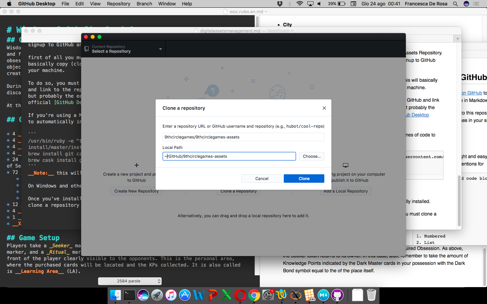

## Web Development Box

9th Circle Games provides a Virtual Machine that mimics our web server at 99% (see below). This way, web designers  can easily start developing without the hassle of configuring a local development box.

### When to use it

You must use this tool when you need a local web development box which looks like 9th Circle Games WordPress Server, for example when you want to update the WordPress themes or plugins we use on our websites.

### How it works

You don't need to download a huge Virtual Machine box. Instead, you're going to use [Vagrant](https://www.vagrantup.com) for this.

Vagrant is a __provisioning tool__ that includes all the needed script to automatically __download__ a Ubuntu box from the web (the same Ubuntu version which is running on 9th Circle Games WordPress server) and for installing a local WordPress on it.

It also install all the plugins which are actually used on our production WordPress.

In details, these actions are performed when you run the Vagrant script:

* Downloading of an Ubuntu box of the same version of our server's one
* Adding all the needed system libraries
* Installing WordPress with a set of default options that are 99% similar to the ones we have on production server
* Downloading and automatically activating the plugins we're using on the production server.
* Installing a useful set of development tools which could be useful during debugging (for example phpmyadmin)
* Installing [WP-CLI](http://wp-cli.org) to interact with WordPress trough a command line interface
* Creating a multi-site WordPress setup which mimics the one we have on the production server.

The provision script are hosted on a [GitHub repository](https://github.com/9thcirclegames/9thcirclegames-web).

__Please note__: our Vagrant box is a forked version of [VCCW](http://vccw.cc), so you could refer to the documentation provided with VCCW for further details of what exactly is installed by default.

### Before Starting

This box is provided in VirtualBox format.

Although Vagrant must be download manually from [the official website](https://www.vagrantup.com), if you use a Mac, VirtualBox can be automatically installed, with a huge time saving.

To install VirtualBox, open a Terminal window and paste the commands:

```
# This command install brew; you just need to run it once
/usr/bin/ruby -e "$(curl -fsSL https://raw.githubusercontent.com/Homebrew/install/master/install)"

# This command install cask; you just need to run it once
brew install cask

brew cask install virtualbox
```

Then, install some needed vagrant plugins before proceed:

```
vagrant plugin install vagrant-hostsupdater
vagrant plugin install vagrant-vbguest
```


__Note:__ the above works only on Mac.

Then, you need to download the [repository zip file](https://github.com/9thcirclegames/9thcirclegames-web/archive/master.zip) and unzip it on a proper folder.

Finally, open a Terminal window, go on the aforementioned folder and launch the command.

```
vagrant up
```

This will launch Vagrant which in turn will configure the VirtualBox machine you're going to use for your local developments. Follow the on-screen instructions and the aforementioned docs to understand what's going on.

You probably also need a [primer in Vagrant](https://www.vagrantup.com/intro/index.html), just to undestand the basic commands (for example, how to recreate a bricked box or how to ssh into it and so on).

Finally, have a look to the [VCCW options file](https://github.com/9thcirclegames/9thcirclegames-web/blob/master/site.yml) to better understand the whole picture.

### Contribute to Vagrant Box

If you want to __contribute__ to our Vagrant Box (adding a new feature, fixing a bug...) rather than just using it, you must have _write_ access to the Repository. Only 9th Circle Games GitHub team has actually, so you must signup to GitHub and ask for being added to the team before proceeding.

First of all you must clone the repository on your local machine. This will basically copy (clone) the content of the repository on a local folder of your machine.

To do so, you must install a tool that allows you to authenticate to GitHub and link to the repositories of your choices. Several tools are available for that, but probably the easiest way to do so (if you're not a developer) is the official [GitHub Desktop Client](https://desktop.github.com).

If you're using a Mac, open a Terminal window and paste these lines of code to automatically install all the needed tools for you.

```
# You should already have installed brew and cask from the previous steps.
brew install git
brew cask install github-desktop
```
__Note:__ this will also install the official _git_ tool, just in case.

On Windows and other systems, GitHub Desktop must be manually installed.

Once you've installed the tools and authenticated with GitHub, you must clone a repository (File > Clone Repository). Once asked, put __9thcirclegames/9thcirclegames-web__ as repo slug and choose a location for the cloned repo (the default should be ok in most cases).



### Adding premium content

Vagrant and WP-CLI cannot downloas premium content, for example themes and plusing, on the local WordPress installation. This because this content cannot be downloaded from the Web (without authentication, I mean).

Thus, these themes and plugins must be added by hand after the provisioning script is finished.


At the moment, we're using premium stuff by [Elegant Themes](https://www.elegantthemes.com).

Ask 9th Circle Games admin for sending a copy of such material (as you may imagine, we cannot put it on the web).

#### Content made by 9th Circle Games

The same must be done with the WordPress themes and plugin made by 9th Circle Games. They are hosted on GitHub, but not on [WordPress.org](https://wordpress.org), thus cannot be automatically downloaded by the Vagrant script (yet).

This topic will be covered in another tutorial.